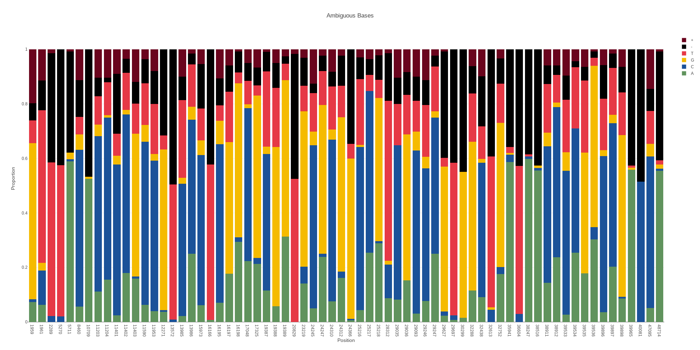

# Ambigviz

ambigviz is a tool for rapidly scanning and visualising ambiguous/mixed bases at given positions in a
BAM file. It was initially written to examine intrahost diversity / co-infection in SARS-CoV-2 samples however it can be used for any BAM file (and scales well thanks to Rust). It uses strict filtering options by default to avoid sequencing artifacts and contamination/sequencing errors, The idea is to rapidly produce plots that are "presentation-ready".

It provides a simple command line interface and requires at minimum a BAM file only.



## Installation

### Cargo:

Requires [cargo](https://www.rust-lang.org/tools/install)

```
cargo install ambigviz
```

### Build from source:

#### Install rust toolchain:

To install please refer to the rust documentation: [docs](https://www.rust-lang.org/tools/install)

#### Clone the repository:

```bash
git clone https://github.com/Sam-Sims/ambigviz
```

#### Build and add to path:

```bash
cd ambigviz
cargo build --release
export PATH=$PATH:$(pwd)/target/release
```

All executables will be in the directory ambigviz/target/release.

## Usage

### Basic usage:

```bash
ambigviz ambig <path_to_bam> <region> [options]
```

At minimum all you need is a BAM file. Ambigviz will look for a `.bai` file in the same directory with the
pattern `[input].bai` - If one
cant be found ambigviz will attempt to index the BAM file for you. If this fails you can index the BAM file yourself
using
samtools.

By default, if no region is provided the entire BAM file will be scanned for ambiguous bases. Combined with the default
threshold of 20% ambiguity, this provides an easy way to quickly scan a BAM file for sequencing errors, contaimination
or co-infection and flag regions of interest for further investigation.

Regions follow the samtools format: `chr:start-end` and all positions are 1-based.

The `--bed` option allows you to output identified ambiguous positions to a bed file.

You can also plot the depth of a BAM file using the depth command.

```bash
ambigviz depth <path_to_bam> <region> [options]
```

### Options:

### Output

`-o, --output <output>`

This option will set the output file name in the format `<chromosome>_<output>` as a BAM file can contain multiple chromosomes and would otherwise be overwritten. Default is to output `<chromosome>_ambig`. 

#### Threshold

`-t, --threshold <threshold>`

This option will set the threshold for the proportion of ambiguous bases at a given position. Any position exceeding
this treshold will be plotted. The maximum value is 0.5 (50%). Default is 0.2 (20%).

#### Indels

`--no-indel`

By default indels are included in the ambiguous base count. This option will exclude them. This is useful for nosiy data
like ONT.

#### Depth

`-D, --depth <depth>`

This option will set the minimum total depth for a position to be included in the plot. Default is 100


#### Base quality

`-q, --base-quality <base-quality>`

This option will set the minimum base quality for a base to be included in the plot. Default is 20

#### Mapping quality

`-Q, --mapping-quality <mapping-quality>`

This option will set the minimum mapping quality for a read to be included in the plot. Default is 60

#### Strand bias

`-s, --strand-bias <strand-bias>`

This option will set the strand bias threshold for a position to be included in the plot. Default is 0.1 (10%). This
means that at least 10% of the depth must come from either strand. For example if you had a position that had 80 reads
of A and 20 reads of C, there must be at least 2 from each strand in C in order for the position to be flagged as
ambiguous and included in the plot. The maximum value is 0.5, requiring that there is an equal amount of depth from each
strand. Setting to 0 will disable this filter.

#### Bed

`--bed`

This option will output the identified ambiguous positions to a bed file. The default is to not output.

#### Labels

`--no-labels`

By default the proportion of each base for each position are included as text annotations. This option will exclude
them.

